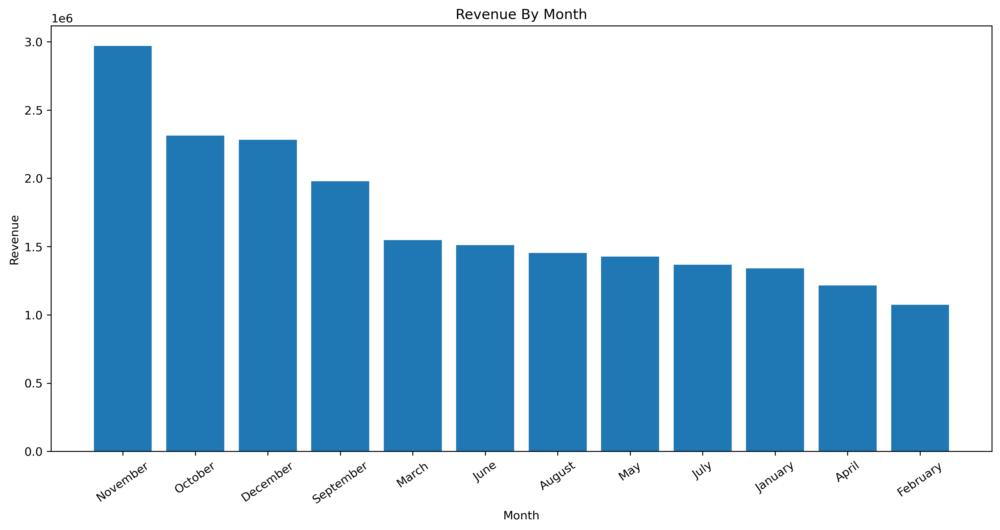
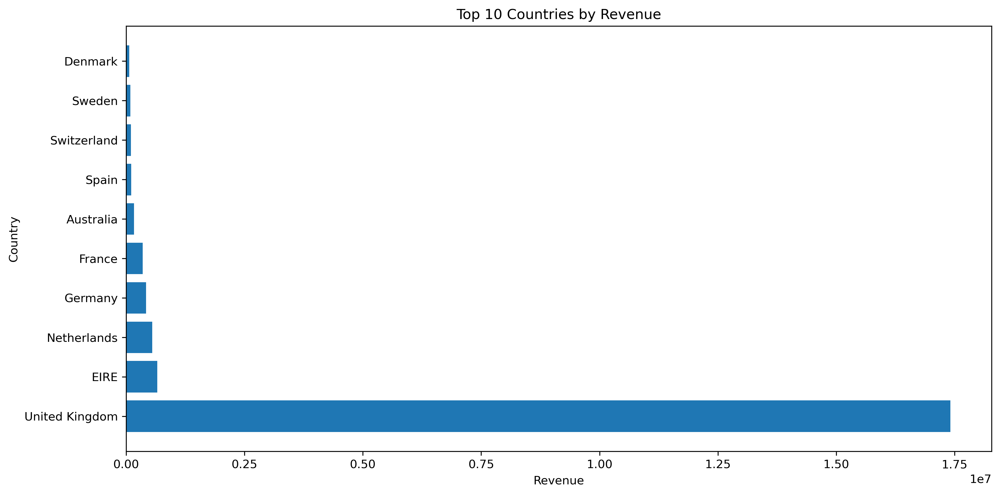

# Online Retail Analytics

An end-to-end data analytics project built using the **Online Retail II** dataset from the **UCI Machine Learning Repository**. The project analyzes over **1 million retail transactions** to uncover sales trends, customer purchasing behavior, product performance, and geographic insights.

The analysis covers the complete data analytics workflow—from **data cleaning** and **exploratory data analysis (EDA)** to **SQL-based business reporting** and **RFM customer segmentation**—to transform raw transactional data into actionable business insights.

---

## Business Objective 

The objective of this project is to analyze historical retail transaction data to answer key business questions, including:

- Which products generate the highest revenue?
- How do sales vary across months and seasons?
- Which countries contribute the most revenue?
- Who are the most valuable customers?
- How can customers be segmented for targeted marketing strategies?

The insights generated from this analysis can support data-driven decision-making in sales, marketing, and customer relationship management.

---

## Project Structure

```
Online-Retail-Analytics/
│
├── data/
│   ├── raw/                               # Original dataset
│   └── cleaned/                           # Cleaned dataset used for analysis
│
├── visualizations/                        # Saved charts used in the README
│
├── 01_data_understanding_and_cleaning.ipynb
├── 02_exploratory_data_analysis.ipynb
├── 03_customer_analytics_rfm.ipynb
│
├── business_queries.sql                   # SQL analysis and business queries
│
└── README.md
```

---

## Dataset

**Source:** [UCI Machine Learning Repository — Online Retail II](https://archive.uci.edu/dataset/502/online+retail+ii)

The dataset contains transactional records from a UK-based online retailer specializing in gift and homeware products. It covers customer purchases made between **December 2009 and December 2011**, making it suitable for sales analysis, customer analytics, and business intelligence tasks.

| Attribute | Details |
|---|---|
| Records | ~1.07 million transactions |
| Original Features | 8 (Invoice, StockCode, Description, Quantity, InvoiceDate, Price, Customer ID, Country) |
| Time Period | Dec 2009 – Dec 2011 |
| Countries | 43 |

---

## Technologies Used

| Category | Technologies |
|---|---|
| Programming Language | Python |
| Data Analysis | Pandas, NumPy |
| Data Visualization | Matplotlib, Seaborn |
| Database | MySQL (Joins, CTEs, Window Functions) |
| Environment | Jupyter Notebook, VS Code |

---

## Project Workflow

The project is organized into three notebooks, each representing a different stage of the analytics workflow.

### 01 — Data Understanding & Cleaning

The raw dataset contained several real-world data quality issues that required careful investigation before analysis.

- Removed **13,579** duplicate records.
- Identified and removed **19,494** cancelled transactions (invoices beginning with **'C'**).
- Investigated **3,457** inventory adjustment records containing negative quantities, zero prices, and missing customer IDs before excluding them from the analysis.
- Removed invalid pricing records and transactions with missing product descriptions.
- Retained records with missing **CustomerID** for sales analysis while excluding them from customer-level analysis.
- Created new features including **Revenue**, **Year**, **Month**, and **Month_Name**.
- Exported a cleaned dataset containing approximately **800,000** transactions for further analysis.

### 02 — Exploratory Data Analysis (EDA)

Business questions explored across four areas:

**Revenue & Sales Trends**
- November consistently recorded the highest monthly revenue across both years, with November 2011 generating over 1.5M — a clear signal of holiday-season demand.
- Q4 was the strongest quarter in both 2010 and 2011, confirming a recurring seasonal pattern the business can plan around.

**Product Performance**
- The top 10 products by revenue are not the same as the top 10 by quantity sold — price matters as much as volume.
- A small number of products drive a disproportionately large share of total revenue.

**Geographic Analysis**
- The United Kingdom contributes 82.82% of total revenue and has 5,350 unique customers — far ahead of any other country.
- The business has customers across 43 countries, but international markets are significantly underdeveloped relative to their potential.

**Customer Behavior**
- Customer spending is heavily right-skewed — most customers spend relatively little, but a small group of high-value customers accounts for a large share of revenue.
- Customer 18102 alone generated £580,987 in total revenue.
- Revenue correlates much more strongly with quantity sold (0.81) than with product price (0.25), meaning volume is the primary driver of revenue in this business.

### 03 — Customer Analytics (RFM Segmentation)

Customers were segmented using the RFM framework — Recency, Frequency, and Monetary value — to move beyond aggregate revenue numbers and understand individual customer behavior.

Each customer was assigned a score from 1 to 4 for Recency, Frequency, and Monetary value before being grouped into one of five customer segments:

| Segment | Description | Recommended Action |
|---|---|---|
| Champion | High recency, frequency, and spend | Loyalty rewards, early product access |
| Loyal Customer | Strong frequency and spend | Membership benefits, upsell opportunities |
| Potential Loyalist | Bought recently but infrequent | Targeted follow-up, limited-time offers |
| At Risk | Previously active, now dormant | Re-engagement campaigns, discount incentives |
| Others | Low activity across all metrics | General promotions, monitor behavior |

Provided business recommendations for improving customer retention and engagement.

---

## SQL Business Analysis

Business questions were explored using **MySQL**, progressing from fundamental data exploration to advanced analytical queries. The SQL analysis complements the Python-based analysis by demonstrating data querying, aggregation, customer analytics, and window function techniques.

The SQL workflow is organized into six sections:

### 1. Data Exploration
- Examined dataset size, unique customers, transaction dates, and overall revenue.
- Performed initial exploration to understand the structure and quality of the dataset.

### 2. Sales Analysis
- Analyzed monthly revenue and order trends.
- Identified top-performing products, customers, and countries.
- Calculated average order value and other sales performance metrics.

### 3. Customer Analysis
- Generated customer performance reports.
- Identified high-value (VIP) customers.
- Segmented customers using SQL `CASE` expressions based on total revenue.

### 4. Country Analysis
- Evaluated revenue contribution by country.
- Identified countries performing above the average revenue.
- Compared market performance across different regions.

### 5. Time-Series Analysis
- Analyzed quarterly and monthly revenue trends.
- Examined seasonal sales patterns and chronological revenue growth.

### 6. Advanced SQL
- Used Common Table Expressions (CTEs) to simplify complex queries.
- Applied window functions including `ROW_NUMBER()`, `RANK()`, `DENSE_RANK()`, `LAG()`, and `PARTITION BY`.
- Calculated running totals and month-over-month revenue growth.
- Identified the highest-performing products and customers within each country.

---

## How to Run

1. Clone this repository.

```bash
git clone https://github.com/your-username/Online-Retail-Analytics.git
```

2. Open the project in **Jupyter Notebook** or **VS Code**.

3. Run the notebooks in the following order:

- `01_data_understanding_and_cleaning.ipynb`
- `02_exploratory_data_analysis.ipynb`
- `03_customer_analytics_rfm.ipynb`

4. Import the cleaned dataset into **MySQL** and execute the queries in `business_queries.sql` to reproduce the SQL analysis.

---

## Sample Visualizations

The following visualizations highlight some of the key findings from the exploratory analysis. Additional charts and analysis are available in the project notebooks.

### Monthly Revenue Trend



Monthly revenue analysis reveals clear seasonality, with **November consistently generating the highest revenue**, followed by October and December. This pattern suggests a significant increase in customer purchasing activity during the holiday shopping season.

### Revenue by Country



The United Kingdom accounted for over **82%** of total revenue, making it the company's primary market.

### Customer Segmentation (RFM)


RFM analysis groups customers based on purchasing behavior, helping identify loyal customers and opportunities for targeted marketing.

---

## Key Findings

- November consistently recorded the highest revenue and order volume, highlighting strong seasonal demand.
- The United Kingdom contributed **82.82%** of total revenue, making it the company's primary market.
- Customer **18102** generated **£580,987**, making them the highest-revenue customer in the dataset.
- A relatively small group of customers contributed a significant share of total revenue, indicating a highly skewed customer value distribution.
- Sales quantity showed a much stronger relationship with revenue (**0.81**) than product price (**0.25**).
- Quarter 4 (October–December) consistently generated the highest revenue, suggesting a recurring seasonal sales pattern.
- RFM segmentation identified distinct customer groups that can support targeted retention and marketing strategies.

---